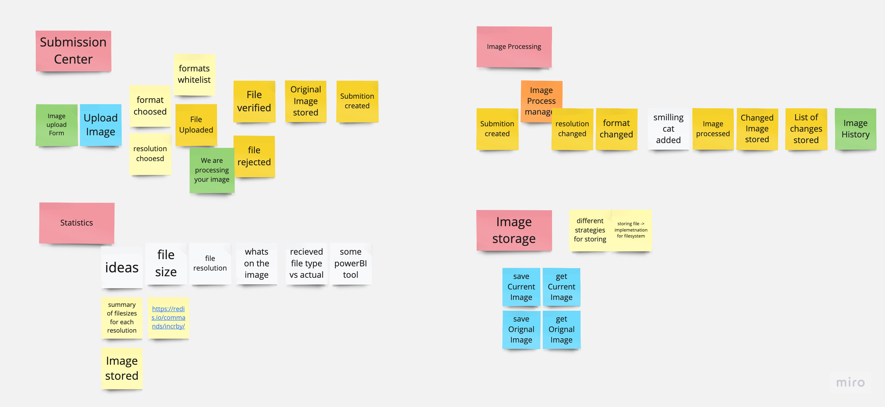

# Requirements

- Images can be:
  - [ ] Scaled to a fixed resolution
  - [ ] Converted to other formats
- [ ] Images can be added through a web interface (form)
- [ ] Information about fact of adding an image should be stored
- [ ] Input images are stored
- [ ] Output images are stored
- [ ] Image needs to be stored optimally on a hard disk with the unique naming system
- [ ] System should collect some statistics using Redis
  - [ ] Case for implementation: Filesize of images in a given resolution

## Stack requirements
- [x] PHP >8.0
- [ ] Laravel, Symfony or Yii
- [ ] Database migrations
- [ ] Some UI without CSS
- [x] Docker
- [x] Use queues if needed
- [x] Tests for code/features
- [x] Documentation of how the System works
- [x] Result on GitHub

# Proposed solution

I found that the project can be split into four modules:
- Image processing
- Statistics
- Web interface for handling submissions for processing images (Submission Center)
- Image Storage

## Submission Center
The user is placing a submission for processing an image.
The original image is stored, and the Submission is sent to the image processing module.
And this is how it ends for the user now.
In the future, there can be an email sent when processing ends,
or webhook support can be added for users who want to wait on the page.

## Image processing
When Submission is received by image processing.
It contains a list of the tasks that need to be performed on Image to fulfill the Submission.
There is a process manager to handle order of changes and allows for future modifications in the process
For example, in the future, we may want to add the "Add smiling cats to the image" feature. There is a place to handle it.

## Statistics
Splitting statistics as a separate module allows for the Statistic team to try any ideas they want without
changes in Image Processing and Submission Center.
It's done by Events sent by the Submission Center and Image Processing.
The statistics team can implement anything they want to measure based on events in the System.

## Image Storage
Image processing needs to be able to receive the file from Submission Center to apply changes.
Also, after the Image is transformed, it needs to be stored. If, in the future, some processing will be done on different services,
they also need to be able to receive files. So there is a need for a separate module for handling storage.

## Image from Event Storming

# Summary after 3 hours
I wanted to spend 1 hour on the task. But after 1 hour, I only had some Event Storming made.
And not all questions were answered. And the task seems to be bigger and bigger.
But modeling and planning is the most important part when working on any software.
So after I modeled every module in the system, I started to write tests for the parts of the systems that are interacting.
I prepared tests for the interfaces between modules (they are still represented as a class because I didn't have more time for it).
After that, I started modeling code inside each module.
Many things need to be implemented, but now when responsibilities between modules are settled each module can focus
on doing its job.

Some technical details that could be implemented in the systems:
- Images:
  - Storing images will be split:
    - representation in Database (Image name, filename, uuid).
    - Image data attached to uuid
  - Storing image data can have different requirements
    - We may want to compress the original files
    - We may want to have the fastest storage for recent image
  - Filesystem
    - there is a limit of files in directories. The implementation should deal with that
    - files should not be accessible by web users
  - Allowlist of formats
- Image processing:
  - The idea is to have a Process that knows the list of steps and what is the current one. So each step can be implemented by different services in future
  - 
